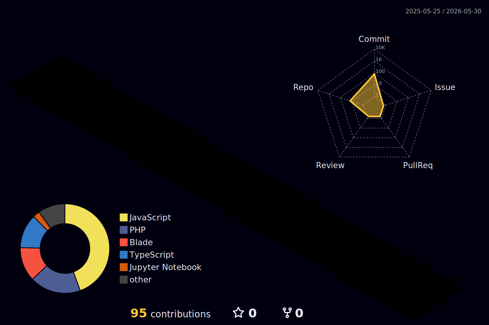

<div align="center">


[](https://git.io/typing-svg)

<p>
  <a href="https://www.linkedin.com/in/kikiizzet"></a>
  <a href="https://www.instagram.com/izzetnity"></a>
  <a href="https://izzet-porto.vercel.app/"></a>
  <a href="mailto:syauqifizan@gmail.com"></a>
  
</p>

</div>

---

## 🧑‍💻 About Me

```yaml
name       : Muhammad Syauqi Izzet Sakovic Sahal
pronouns   : He / Him
location   : Malang, East Java, Indonesia 🇮🇩
education  : Informatics Management — Politeknik Negeri Malang
status     : Undergraduate Student & Active Developer
languages  : Indonesian 🇮🇩 | English 🇬🇧
```

> *"Code is poetry — I write it with purpose, clarity, and elegance."*

---

## 🚀 Tech Stack & Skills

<div align="center">

### 🌐 Web Development


### 📡 IoT & Embedded Systems


### 📊 Data & Analytics


### 🏭 ERP & Business Tools


### 🛠 Tools & Platforms


</div>

---

## 📈 GitHub Statistics

<div align="center">


</div>


---

## 📌 Featured Projects

| Project | Description | Stack |
|---|---|---|
| 💡 [Smart Lighting IoT Monitor](https://izzet-porto.vercel.app/) | Web-based IoT monitoring system for smart lighting with MQTT & real-time data | JS · Laravel · Python · MQTT |
| 🤖 [Smart Recruit System](https://izzet-porto.vercel.app/) | AI-powered recruitment system with automated candidate screening & HR workflows | Python · React · PostgreSQL |
| ✈️ [Travel & Umroh Platform](https://github.com/kikiizzet) | Full-stack travel package management with admin panel, gallery & testimonials | NestJS · React · PostgreSQL |
| 🕌 [Al Anshor Alfa Mulia](https://izzet-porto.vercel.app/) | Institutional website with programs, information & digital presence | HTML · CSS · JavaScript |

<div align="center">

[](https://izzet-porto.vercel.app/)

</div>

---

## 🌟 What I'm Working On

- 🔭 Building a **Travel & Umroh Package Management Platform** with NestJS + React
- 🌱 Deepening my knowledge in **DevOps** & **Machine Learning**
- 🤝 Open to collaborate on **IoT solutions**, **Web Apps**, and **Data projects**
- 📫 Reach me via **[LinkedIn](https://www.linkedin.com/in/kikiizzet)** · **[Instagram](https://www.instagram.com/izzetnity)** · **[Portfolio](https://izzet-porto.vercel.app/)** · **[syauqifizan@gmail.com](mailto:syauqifizan@gmail.com)**

---

## 🐍 Contribution Snake

<div align="center">

<picture>
  <source media="(prefers-color-scheme: dark)" srcset="https://raw.githubusercontent.com/kikiizzet/kikiizzet/output/github-contribution-grid-snake-dark.svg" />
  <source media="(prefers-color-scheme: light)" srcset="https://raw.githubusercontent.com/kikiizzet/kikiizzet/output/github-contribution-grid-snake.svg" />
  
</picture>

</div>

## 🌐 3D Contribution Graph

<div align="center">



</div>

---

## 💡 Quote

<div align="center">

> *"The best error message is the one that never shows up."*
> — **Thomas Fuchs**

</div>

---

<div align="center">


**✨ Thanks for visiting my profile! Let's build something amazing together. ✨**

</div>
